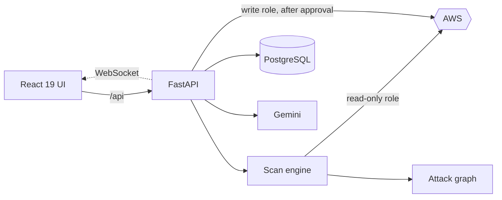

<div align="center">


<a href="#-quick-start">
  
</a>

<br><br>

[](https://cloud-security-posture-delta.vercel.app)
[](https://github.com/anshumaan12-2003/nimbus-risk-sentinel/actions/workflows/ci.yml)


<a href="#-quick-start"><b>Quick start</b></a> &nbsp;·&nbsp;
<a href="#-features"><b>Features</b></a> &nbsp;·&nbsp;
<a href="#-built-with"><b>Stack</b></a> &nbsp;·&nbsp;
<a href="#-security"><b>Security</b></a>

</div>

<br>

<picture>
  <source media="(prefers-color-scheme: dark)" srcset="docs/readme/overview-dark.png">
  <source media="(prefers-color-scheme: light)" srcset="docs/readme/overview-light.png">
  
</picture>

## ✨ Features

<table>
<tr>
<td width="33%" valign="top">

**🔍 Find**<br>
19 rules across IAM, S3, EC2 and RDS, mapped to CIS, SOC 2, PCI DSS and HIPAA.

</td>
<td width="33%" valign="top">

**🕸️ Explain**<br>
An attack graph from the internet to your data, plus a breach simulator that finds the fewest fixes to cut every path.

</td>
<td width="33%" valign="top">

**🛡️ Fix safely**<br>
One person requests, a *different* person approves. Every fix is verified and can be rolled back.

</td>
</tr>
<tr>
<td valign="top">

**🤖 Vesper AI** <kbd>⌘ J</kbd><br>
Streamed answers from your latest scan, with findings cited as clickable chips.

</td>
<td valign="top">

**⚡ Live scans**<br>
Progress per service × region pushed over WebSocket, including permission gaps.

</td>
<td valign="top">

**⌨️ Keyboard first** <kbd>⌘ K</kbd><br>
Command palette, `g`-shortcuts, light and dark themes, works on a phone.

</td>
</tr>
</table>

<table>
<tr>
<td width="50%"></td>
<td width="50%"></td>
</tr>
<tr>
<td align="center"><sub><b>Attack paths</b></sub></td>
<td align="center"><sub><b>Vesper assistant</b></sub></td>
</tr>
</table>

<details>
<summary><b>More screenshots</b></summary>
<br>

<table>
<tr>
<td width="50%"></td>
<td width="50%"></td>
</tr>
<tr>
<td></td>
<td></td>
</tr>
</table>
</details>

## 🚀 Quick start

**Just want to look?** Open the [live demo](https://cloud-security-posture-delta.vercel.app). The first load can take a minute while the free server wakes up.

**Run it locally.** No AWS account needed: the demo runs on a fake, deliberately vulnerable account ([moto](https://github.com/getmoto/moto)).

```bash
cd backend && python3.12 -m venv .venv && source .venv/bin/activate
pip install -r requirements-dev.txt && python tests/dev_server_fake_aws.py
```

```bash
cd frontend && npm ci && API_PROXY_TARGET=http://127.0.0.1:8000 npm run dev
```

Open **http://localhost:3000** and sign in as `admin@breachpath.local` / `breachpath-demo-password` (`engineer@`, `approver@` and `viewer@` work too).

Prefer containers? `docker compose up --build` starts Postgres, Redis, the API, Celery and the UI.

<details>
<summary><b>Use a real AWS account or deploy it</b></summary>
<br>

- **Real account:** give Breachpath an identity with `SecurityAudit` + `ViewOnlyAccess`, copy `backend/.env.example` to `.env`, set a `SECRET_KEY` (`openssl rand -hex 32`), then `alembic upgrade head && uvicorn app.main:app --port 8000`. Fixes stay off until `REMEDIATION_ENABLED=true`.
- **Deploy:** run [`infra/aws/setup-render-scanner.sh`](infra/aws/setup-render-scanner.sh) in CloudShell, create a Render Blueprint from [`render.yaml`](render.yaml), and import the repo into Vercel with root `frontend`.

</details>

## 🧰 Built with

<p align="center">
  
</p>



## 🔐 Security

- **Least privilege:** scanning is read-only; fixes use a separate write role and are off by default.
- **Four-eyes changes:** whoever requests a fix can't approve it, and both names are audited.
- **Hardened sessions:** Argon2id passwords, in-memory access tokens, rotating `httpOnly` refresh cookies with reuse detection.
- **Honest results:** a fix counts only after AWS is re-read to confirm it; unchecked controls are never marked as passing.

Tested with **pytest + moto**, **Vitest** and **Playwright** (flows, accessibility and visual regression) on every push.

<br>

<div align="center">
<sub>Built by <a href="https://github.com/anshumaan12-2003">Anshumaan Singh</a> · Upgrade notes and changelog in <a href="RUNBOOK.md">RUNBOOK.md</a></sub>
</div>
