<div align="center">


<br>

[](https://github.com/anshumaan12-2003/nimbus-risk-sentinel/actions/workflows/ci.yml)


**Scans your AWS account, shows how an attacker would move through it, and fixes it only after a second person approves.**

[Features](#-what-it-does) · [Screenshots](#-a-closer-look) · [Quick start](#-quick-start) · [Deploy](#-deploy) · [Architecture](#-architecture) · [Security model](#-security-model) · [Tests](#-tests)

</div>

<br>

<picture>
  <source media="(prefers-color-scheme: dark)" srcset="docs/readme/overview-dark.png">
  <source media="(prefers-color-scheme: light)" srcset="docs/readme/overview-light.png">
  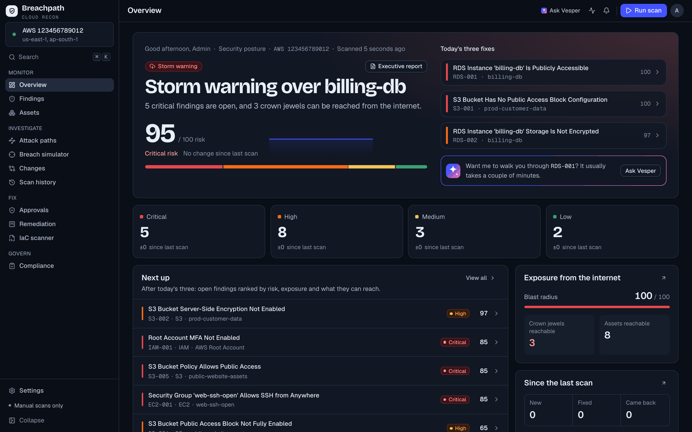
</picture>

<sub>Screenshots use the built-in fake AWS account. The image follows your GitHub light/dark theme.</sub>

---

## ✦ What it does

<table>
<tr>
<td width="33%" valign="top">

### 🔍 Finds
**19 rules** across IAM, S3, EC2 and RDS, run in parallel **per service × region**. Each finding is ranked by severity, exposure and what it can reach, and mapped to **CIS, SOC 2, PCI DSS and HIPAA** controls.

</td>
<td width="33%" valign="top">

### 🕸️ Explains
An **attack graph** built from a live inventory of your account: internet → edge → compute → identity → data. The **breach simulator** lets you start a breach anywhere and cut links to see what's still reachable.

</td>
<td width="33%" valign="top">

### 🛡️ Fixes, safely
An engineer **requests** a fix and a *different* approver **applies** it. Breachpath reads the live resource, changes it, reads it again to prove the fix worked, and **stores a rollback**.

</td>
</tr>
</table>

### A forecast, not an alarm

The Overview opens with the weather for your account, worked out only from scan data: a **storm warning** when anything critical is open, **scattered risk** when only high-severity findings are, **clear skies** otherwise. It names the riskiest resource, says why in one sentence, and lists **today's three fixes**. Numbers roll when a scan changes them, so you see things get better.

### Meet Vesper, the assistant

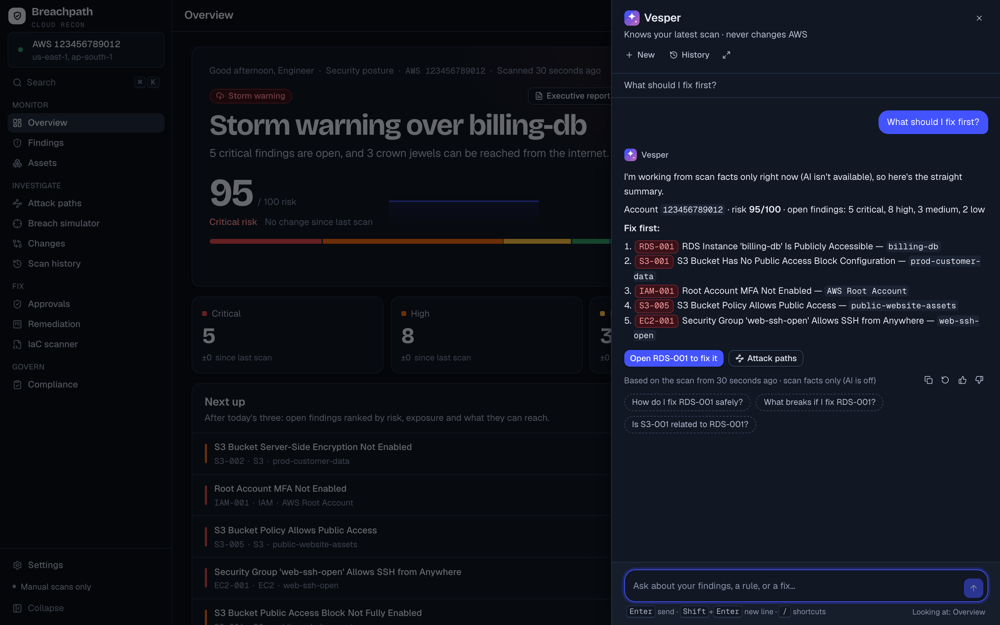

Press <kbd>⌘</kbd> <kbd>J</kbd> anywhere. Vesper answers **as it writes**, from your latest scan only, and **cites findings as chips** you can click. It knows which page and finding you're looking at, keeps **conversations per user** (nobody else can read them), and offers slash commands (`/fix`, `/explain`, `/report`) and follow-ups. It **can't change AWS**: fixes still go through a request and a second person's approval. Without an AI key it answers from scan facts and says so.

### Watch a scan happen

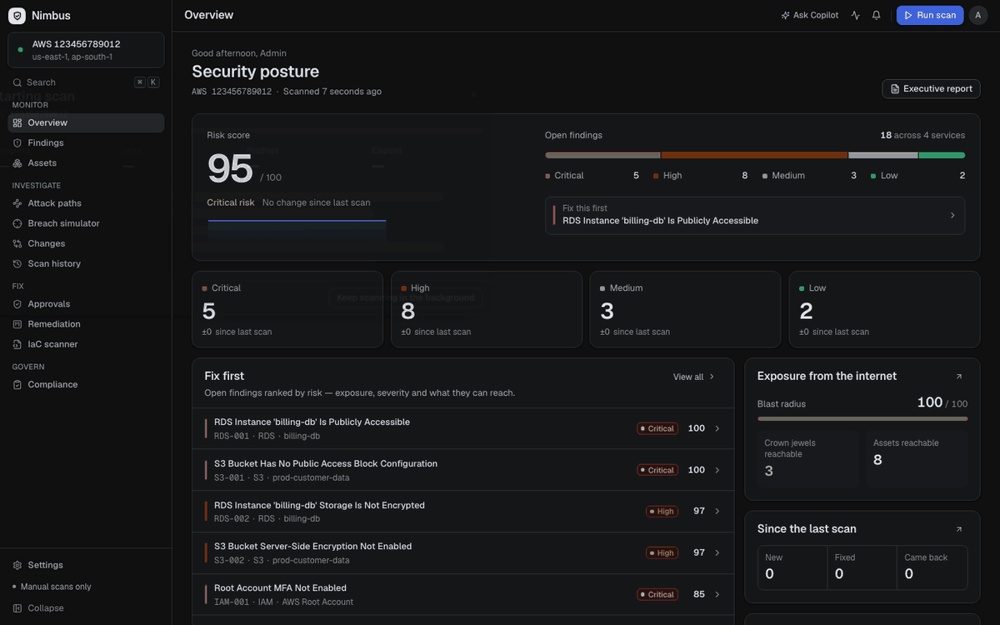

Each cell is one unit of work: a service in a region. Progress is **pushed over a WebSocket** and **saved on the scan**, so a reload, a second tab or a Celery worker in another process all show the same state. Permission gaps (`AccessDenied`) appear as they happen instead of silently producing an empty dashboard.

---

## ✦ A closer look

<table>
<tr>
<td width="50%">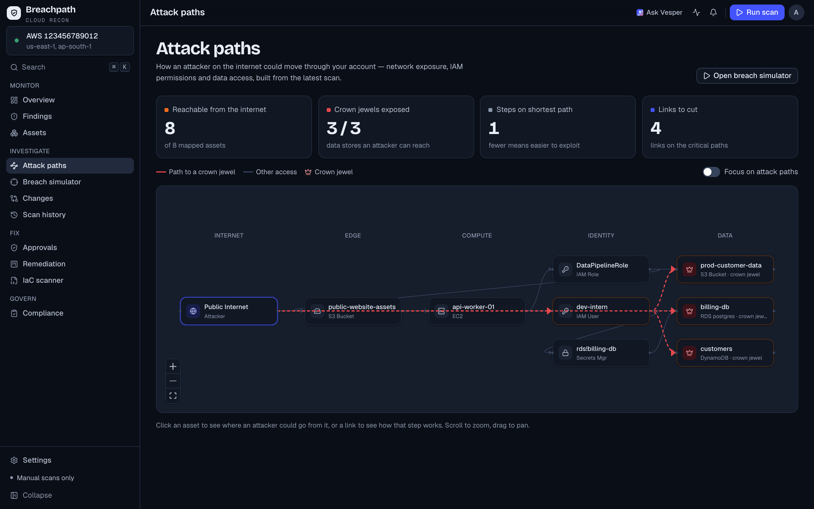</td>
<td width="50%">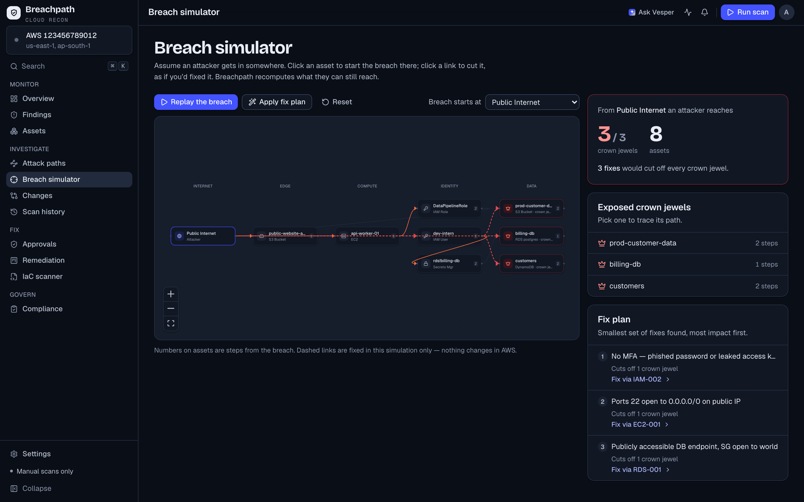</td>
</tr>
<tr>
<td><b>Attack paths</b>: how an attacker on the internet reaches your crown-jewel data stores, and which links to cut.</td>
<td><b>Breach simulator</b>: the smallest set of fixes that cuts off every crown jewel, most impact first.</td>
</tr>
<tr>
<td>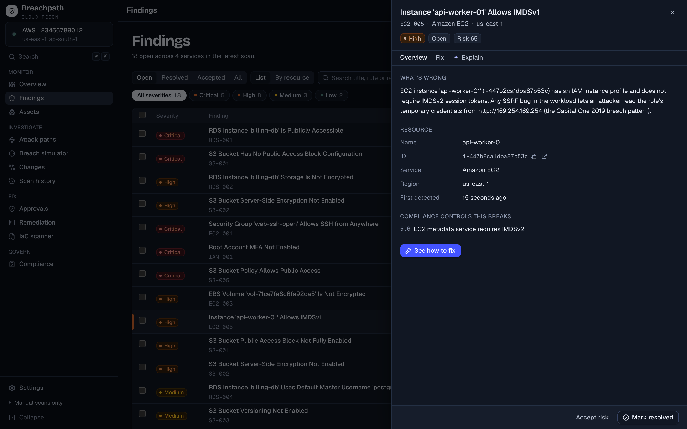</td>
<td>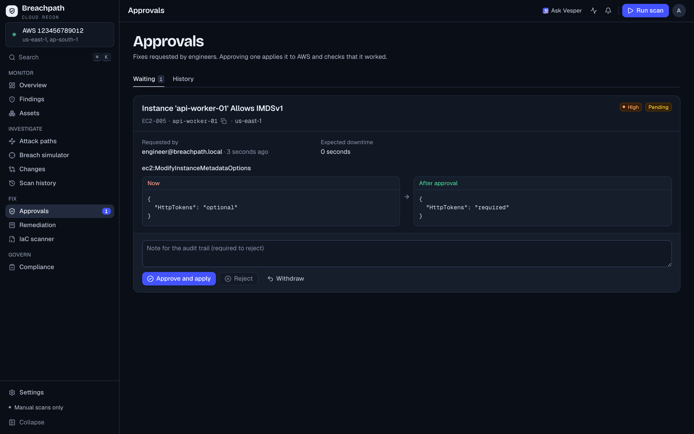</td>
</tr>
<tr>
<td><b>Findings</b>: what's wrong, why it matters, the exact resource and the compliance controls it breaks. Every finding has a shareable link.</td>
<td><b>Four-eyes approvals</b>: the before/after preview is frozen when requested, and the audit trail records both names.</td>
</tr>
<tr>
<td>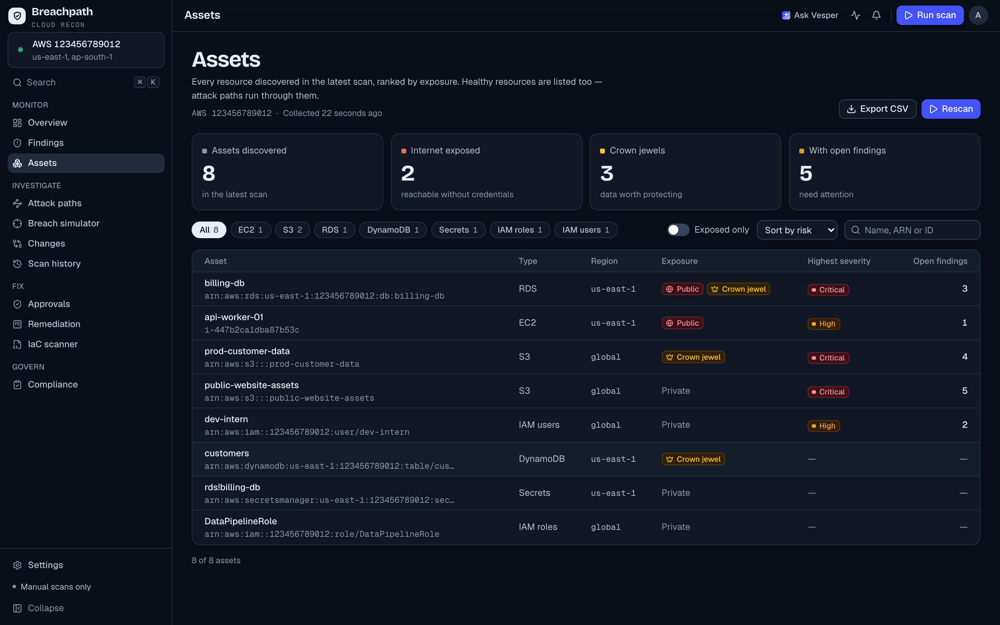</td>
<td>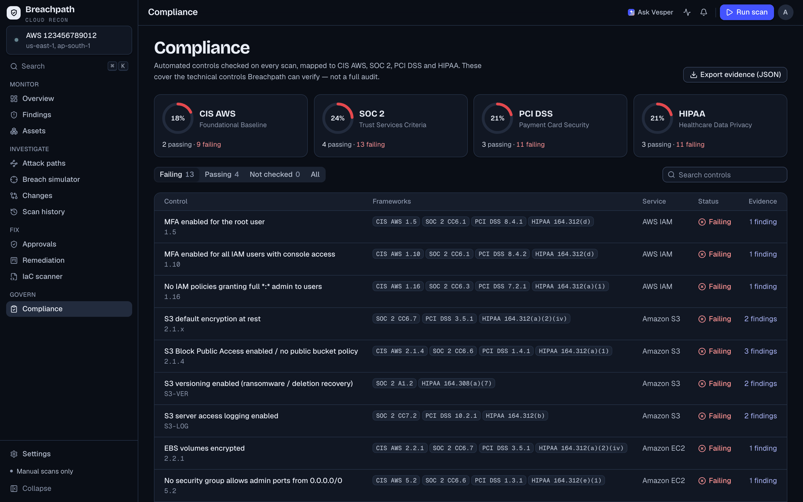</td>
</tr>
<tr>
<td><b>Assets</b>: every EC2, S3, RDS, Lambda, DynamoDB, Secrets Manager and IAM resource, ranked by exposure.</td>
<td><b>Compliance</b>: a score ring per framework, and PASS / FAIL / NOT EVALUATED per control. Controls Breachpath couldn't see are never counted as a pass.</td>
</tr>
<tr>
<td colspan="2">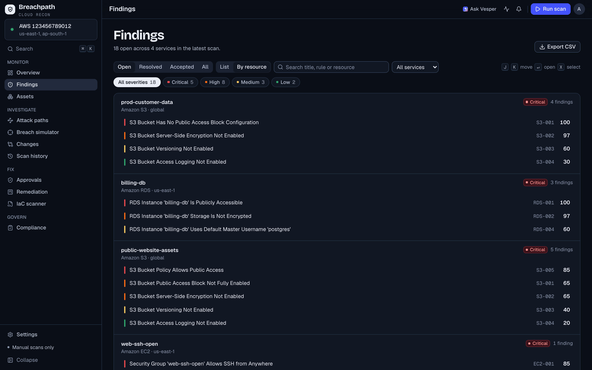</td>
</tr>
<tr>
<td colspan="2"><b>Findings by resource</b>: fixing usually happens one resource at a time, so group findings under each resource, riskiest first.</td>
</tr>
</table>

<details>
<summary><b>📱 On a phone</b></summary>
<br>
<p align="center">
  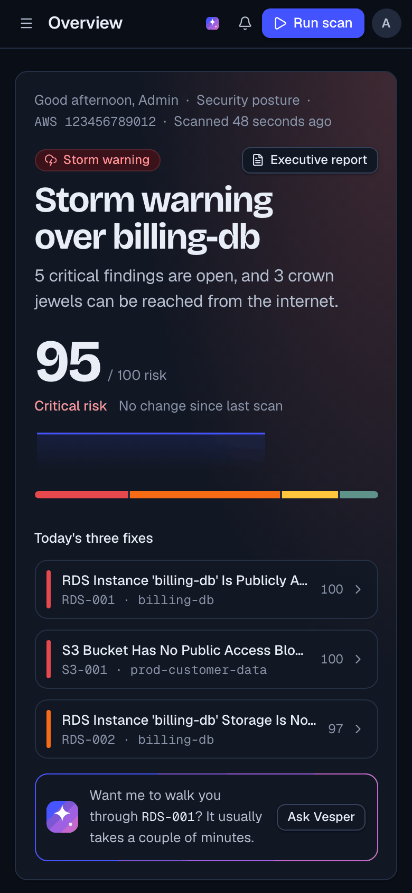&nbsp;
  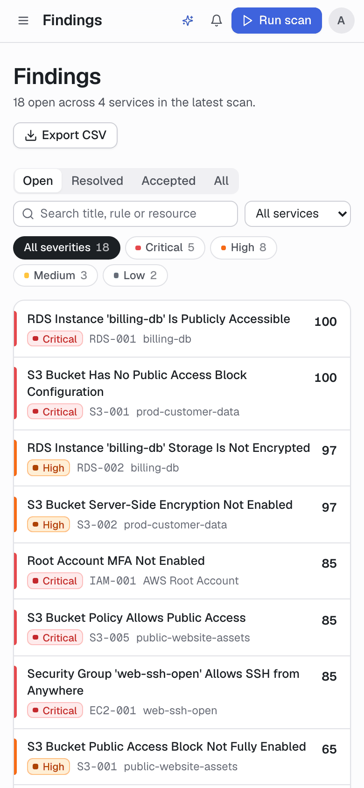&nbsp;
  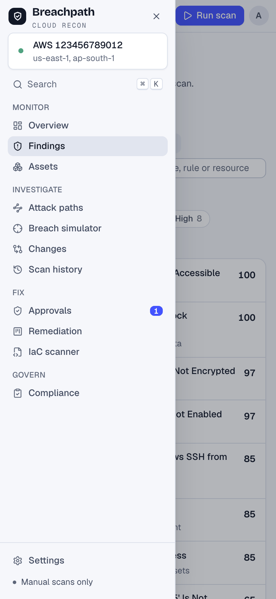
</p>
<p align="center"><sub>Below 900px the sidebar becomes a drawer. A browser test checks that no page scrolls sideways at 390px.</sub></p>
</details>

<details>
<summary><b>✨ Everything else</b></summary>
<br>

| | |
|---|---|
| **Vesper** (<kbd>⌘</kbd> <kbd>J</kbd>) | Streamed, cited answers from the latest scan (Gemini), saved per user, rate-limited per user. A full page at `/vesper` too. |
| **Wakes up gracefully** | On free hosting the API sleeps; Breachpath says *Waking Breachpath up…*, retries on its own and signs you in when it's ready. |
| **Command palette** (<kbd>⌘</kbd> <kbd>K</kbd>) | Search findings and assets by name, ARN or rule id, and jump to any page. |
| **Keyboard first** | `g d` overview, `g f` findings, `g t` attack paths, `g p` approvals; <kbd>?</kbd> lists them all. |
| **Changes** | What's new, fixed or came back since the last scan, using stable AWS ids so drift is real. |
| **Scan history** | Success rate, mean duration, risk trend, and a "blind spots" list of every AWS call that was denied. |
| **IaC scanner** | Check Terraform before it ships, in the UI or from CI with `cli/breachpath_cli.py` (fails the build on CRITICAL). |
| **Executive report** | One-page summary of posture for stakeholders. |
| **Slack** | Alerts only on **new** criticals, so no alert fatigue. |
| **Scheduled scans** | In-process scheduler, or Celery beat under Docker Compose. |
| **Light & dark** | Both themes are covered by visual regression tests. |

</details>

---

## ✦ Detection rules

<details>
<summary><b>19 rules</b> across 4 services</summary>
<br>

| Service | Rule | Checks |
|---|---|---|
| **IAM** | `IAM-001` | Root account has no MFA |
| | `IAM-002` | IAM user has no MFA device |
| | `IAM-003` | IAM user has administrator access |
| | `IAM-004` | Access key older than the rotation window |
| | `IAM-005` | IAM user has never signed in |
| **S3** | `S3-001` | Public access block not fully enabled |
| | `S3-002` | Server-side encryption not enabled |
| | `S3-003` | Versioning not enabled |
| | `S3-004` | Access logging not enabled |
| | `S3-005` | Bucket policy allows public access |
| **EC2** | `EC2-001` | Security group allows SSH from anywhere |
| | `EC2-002` | Security group allows RDP from anywhere |
| | `EC2-003` | EBS volume not encrypted |
| | `EC2-004` | Public IP plus an all-traffic inbound rule |
| | `EC2-005` | Instance with a role still allows IMDSv1 (the Capital One 2019 pattern) |
| **RDS** | `RDS-001` | Instance is publicly accessible |
| | `RDS-002` | Storage not encrypted |
| | `RDS-003` | Automated backups disabled |
| | `RDS-004` | Default master username |

</details>

---

## ✦ Quick start

### Try it in 2 minutes, no AWS account needed

The fake AWS account (built on [moto](https://github.com/getmoto/moto)) comes pre-seeded with a vulnerable environment and one user per role.

```bash
# 1 · API on a fake, deliberately vulnerable AWS account
cd backend
python3.12 -m venv .venv && source .venv/bin/activate
pip install -r requirements-dev.txt
python tests/dev_server_fake_aws.py
```

```bash
# 2 · UI (in a second terminal)
cd frontend
npm ci
API_PROXY_TARGET=http://127.0.0.1:8000 npm run dev
```

Open **http://localhost:3000** and sign in as `admin@breachpath.local` / `breachpath-demo-password`. You can also use `engineer@`, `approver@` or `viewer@` to see what each role can do.

### Against your real AWS account

<details>
<summary>Step by step</summary>
<br>

1. **Create a read-only identity.** Attach the AWS managed policies `SecurityAudit` and `ViewOnlyAccess` (SSO permission set, or an IAM user). Breachpath never needs write access to scan.
2. **Configure the API:**
   ```bash
   cd backend
   cp .env.example .env            # set AWS_PROFILE, AWS_REGIONS, AI_API_KEY (optional)
   openssl rand -hex 32            # paste as SECRET_KEY; the API refuses to start without one
   alembic upgrade head
   uvicorn app.main:app --reload --port 8000
   ```
3. **Start the UI** with `API_PROXY_TARGET=http://127.0.0.1:8000 npm run dev`. The first visit shows a one-time screen to create the admin account.
4. **Fixes stay off** until you set `REMEDIATION_ENABLED=true` and, ideally, a separate write role in `AWS_REMEDIATION_ROLE_ARN`.

</details>

### Full stack with Docker

```bash
docker compose up --build        # Postgres · Redis · API · Celery worker + beat · UI
```

---

## ✦ Deploy

The repo includes config for **Render** (API + Postgres) and **Vercel** (UI):

| File | What it sets up |
|---|---|
| [`render.yaml`](render.yaml) | Blueprint for the API and Postgres. Generates `SECRET_KEY` and a `SETUP_TOKEN` so a stranger can't claim the first-admin screen. |
| [`frontend/vercel.json`](frontend/vercel.json) | Proxies `/api` to Render, so the browser sees **one origin** and the strict `httpOnly` refresh cookie keeps working. Also adds security headers. |
| [`infra/aws/setup-render-scanner.sh`](infra/aws/setup-render-scanner.sh) | Creates a read-only `NimbusScannerRole` plus a user whose **only** permission is assuming it with an external ID. |

1. Run `infra/aws/setup-render-scanner.sh` in AWS CloudShell. It prints four values.
2. In Render, choose **New → Blueprint**, pick this repo and paste the four values.
3. In Vercel, **import** this repo and set **Root Directory** to `frontend`.
4. Open your Vercel URL and create the admin account using `SETUP_TOKEN` from Render.

---

## ✦ Architecture

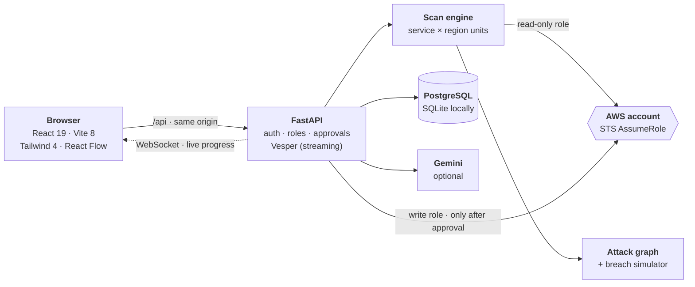

<details>
<summary><b>Stack and layout</b></summary>
<br>

| Layer | Tech |
|---|---|
| UI | React 19, Vite 8 (Rolldown), Tailwind CSS 4, Radix primitives, TanStack Query + Table, React Flow 12, Recharts 3, NumberFlow |
| Type | Geist and Geist Mono for reading; Bricolage Grotesque for titles and hero numbers (all self-hosted) |
| API | Python 3.12, FastAPI, SQLAlchemy 2, Alembic, Pydantic 2 |
| AWS | boto3 with cached, auto-refreshing AssumeRole sessions and adaptive retries |
| Jobs | In-process background scans + scheduler, or Celery + Redis + beat |
| Data | SQLite locally, PostgreSQL in production |
| Auth | Argon2id (`pwdlib`), PyJWT, httpOnly refresh cookies |
| Tests | pytest + moto, Vitest, Playwright (flows, a11y, visual regression) |

```
backend/
  app/api/routes/      REST + auth endpoints
  app/scanner/aws/     IAM · S3 · EC2 · RDS rules; inventory collector
  app/intelligence/    attack graph builder, compliance mapping, Vesper's engine
  app/remediation/     read → change → verify → rollback
  app/auth/            hashing, tokens, role dependencies
  tests/               pytest on a moto account + dev_server_fake_aws.py
frontend/
  src/pages/           one file per route
  src/components/ds/   design system (buttons, cards, sheets, TimeAgo, AnimatedNumber, ScoreRing…)
  src/components/vesper/  the assistant: panel, full page, streaming client, citations
  e2e/                 Playwright flows, a11y, visual specs + baselines
infra/aws/             IAM trust/remediator policies, Render setup script
cli/breachpath_cli.py      IaC scanner for CI
```

</details>

---

## ✦ Security model

Breachpath holds credentials to your cloud, so it's built to the standard it checks you against.

| | |
|---|---|
| **Least privilege** | Scanning uses `SecurityAudit` + `ViewOnlyAccess` only. Fixes use a **separate** write role and are off by default (`REMEDIATION_ENABLED=false`). |
| **Four-eyes changes** | The person who requests a change can't approve it. Both names come from their sessions, never from the request body. This is the control auditors look for (SOC 2 CC8.1). |
| **Passwords** | Argon2id. Unknown emails still run a hash, so response times don't reveal which accounts exist. 5 failed attempts per email+IP locks sign-in for 15 minutes. |
| **Sessions** | 15-minute access token held **only in memory**, never in `localStorage`. The refresh token lives in an `httpOnly`, `SameSite=Strict` cookie, and only its SHA-256 is stored. |
| **Stolen tokens** | Refresh tokens rotate on every use. Replaying an old one revokes the whole session family. |
| **Instant revocation** | A role change, password change or deactivation takes effect on the user's next click, not when their token expires. |
| **First-admin claim** | In production a `SETUP_TOKEN` is required to create the first admin. |
| **Honest results** | A fix is reported only after re-reading AWS proves it worked. Controls Breachpath couldn't evaluate are marked `NOT_EVALUATED`, never passed. |

### Roles

| Role | Can |
|---|---|
| `viewer` | See everything, watch running scans, ask Vesper |
| `engineer` | + run scans, triage findings, preview and **request** fixes, scan IaC |
| `approver` | + **approve or reject** fixes (approving is what changes AWS) |
| `admin` | + add people, change roles, reset passwords, deactivate accounts |

The UI never hides what you can't do. It disables the control and tells you why: *"Needs the engineer role; you are viewer."*

---

## ✦ Tests

| Suite | Count | What it proves |
|---|---:|---|
| **Backend** · pytest | 30 | Full pipeline on a fake AWS account; auth, RBAC, token rotation and reuse, lockout, four-eyes, progress grid, Vesper streaming, citations and **per-user privacy** |
| **Unit + route smoke** · Vitest | 22 | Every page renders real API data, signed in; the forecast and progress wording rules |
| **Browser** · Playwright | 30 | Sign-in, reload keeps session, viewer can't act, live scan grid, four-eyes approval, self-approval blocked, Vesper (streaming, citations, history, older-API fallback), waking from sleep, findings by resource, phone layout, **axe in both themes**, and **visual regression** (8 screens × desktop + Pixel 7) |

```bash
cd backend && pytest -q
cd frontend && npm test                                              # API must be running
cd frontend && NIMBUS_PYTHON=../backend/.venv/bin/python npx playwright test
```

CI runs all of it on every push, inside the official Playwright container. Visual baselines come from that same container, via the **Update visual baselines** workflow.

<details>
<summary>Refreshing the README images</summary>
<br>

```bash
cd frontend
FAKE_LATENCY=2.5 NIMBUS_PYTHON=../backend/.venv/bin/python npm run docs:screenshots
python3 ../docs/readme/build_images.py      # shrinks PNGs, builds live-scan.gif
```

All images come from the fake AWS account, never a real one.

</details>

---

## ✦ Roadmap

- [ ] SSO / OIDC sign-in
- [ ] Multi-account scanning through AWS Organizations (`NimbusScannerRole` in each account)
- [ ] Redis-backed rate limits for multiple API replicas
- [ ] Email delivery for invites and password resets
- [ ] Server-side remediation board (column and owner)
- [ ] PDF / CSV executive report from real data

<br>

<div align="center">
<sub>Built by <a href="https://github.com/anshumaan12-2003">Anshumaan Singh</a> · See <a href="RUNBOOK.md">RUNBOOK.md</a> for upgrade notes and the full changelog.</sub>
</div>
